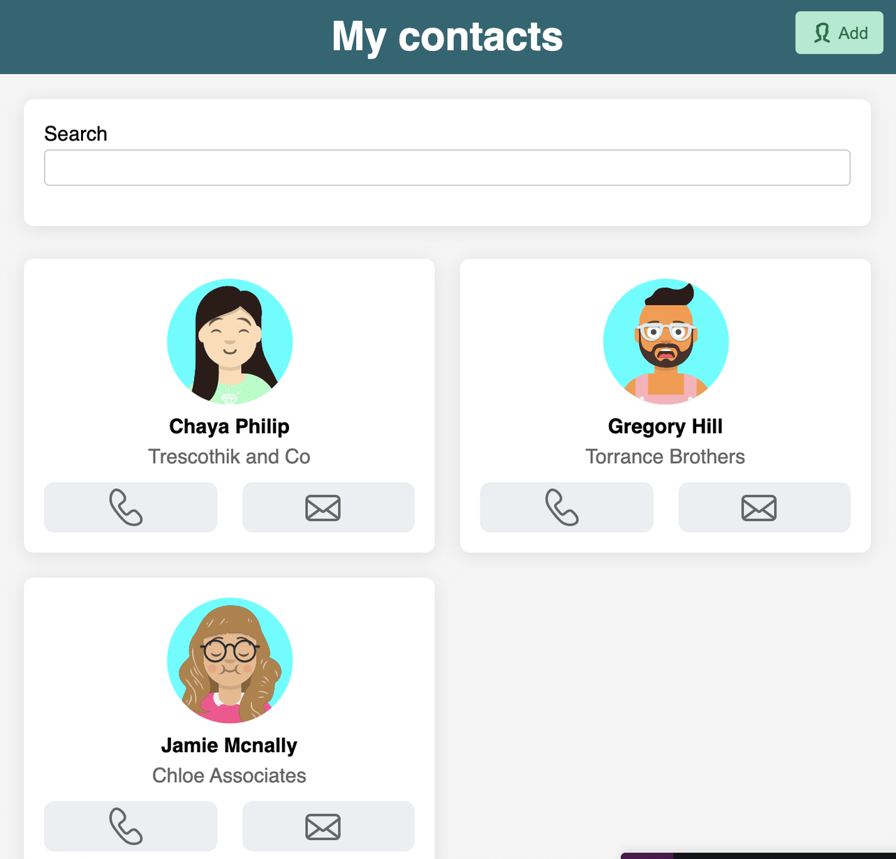
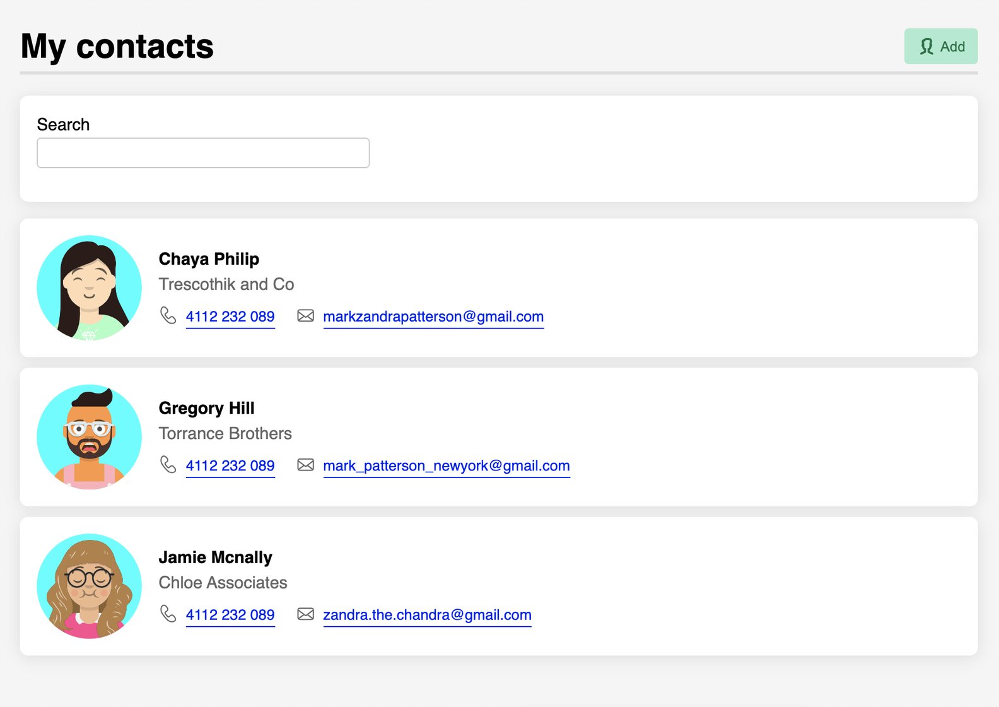

# leah-feelix-project

## To start the app

1. clone the repo to your local machine
2. change directory to "contacts-app"
3. run app locally:

```
npm start
```

## To test the app

(working in progress)

## Part A - Create Mock-up without Feelix

### Features

1. Create My contacts Page (Done)
2. Add filter function (Done)
3. Create New Contact Page (Done)
4. Form Validation for first name(required), last name(requied), phone(valid format) and email(valid format) is added to New Contact Page (Done)
5. Page Change by button toggle function. (Done)
6. Add Unit Tests (In progress)

### Technical

1. Add PropType
2. use shortId to generate random id

### My-Contacts-mobile Mock-up



### My-Contacts-Desktop Mock-up


